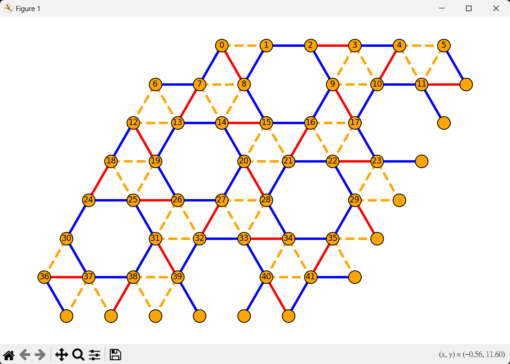

# Maple-Leaf Lattice
## Introduction
### Maple leaf Lattice
Maple-Leaf Lattice is a periodic pattern composed of triangulars and hexagons
### Project
It is a project help us generating a maple-leaf pattern lattice and visualize in networkx graph

## Installation
```bash
pip install -r ./requirements.txt
```

## usage
- `python ./main.py [-L] [-W]`
  - ex: `python .\main.py 7 7`
  - `[-L]` and `[-W]` are suggested to be multiples of 7
  - otherwise, the periodic of maple-leaf may not show in correct pattern

- `python ./main.py [-L] [-W] [-hexinit]`
    ex: - `python .\main.py 7 7 1`
    - customize the hexagon initial position, default: 0

## Visualize Figure Examples
- Maple Leaf Lattice (Visualize with Networkx Graph)
- default: not label the hexagon and not label strength
<table >
  <tr>
    <td><b>Maple Leaf plain graph</b></td>
    <td><b>Labeled bond strength</b></td>
    <td><b>Labeled hexagons position</b></td>
  </tr>
  <tr>
    <td> 
    <td> 
    <td>
  </tr>
</table>
